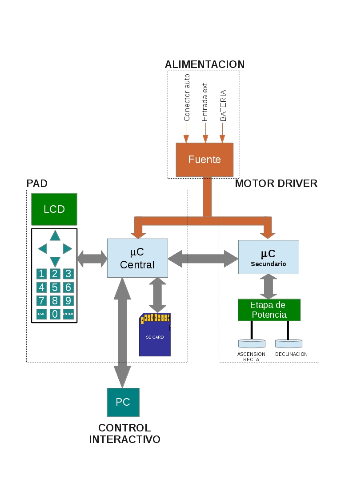

# Telescope Automation

Embedded telescope control with two Atmega in C. That was my final thesis in 2013.

## Documentation

For detailed explanation look up the thesis file in doc.

## Hardware architecture

## Demostration

